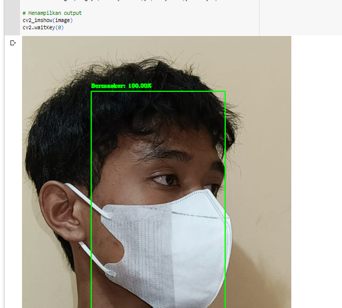
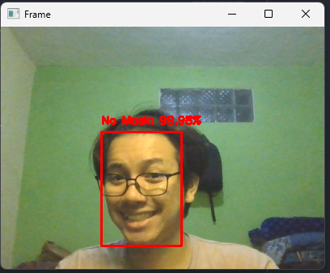

# Face Mask Detection

## Penjelasan Singkat

Aplikasi ini dibuat untuk mendeteksi pemakaian masker muka secara real-time menggunakan deep learning. Program ini menggunakan kombinasi algoritma CNN (Convolutional Neural Network) dan algoritma deteksi wajah. Program CNN dibuat menggunakan Google Collaboratory dengan bahasa pemrograman Python. Framework yang digunakan adalah Keras dan Tensorflow. File akan disimpan dalam bentuk file Jupyter Notebooks (.ipynb). File program (.ipynb) akan disimpan dalam repositori Github. Dataset train dan validasi juga akan disimpan di Github dengan dua macam kelas yaitu with_mask dan without_mask yang didapatkan dari GitHub milik Chandrikadeb7 (https://github.com/chandrikadeb7/Face-Mask-Detection/tree/master/dataset). Jumlah dataset total 3835 gambar dengan 1916 kelas with_mask dan 1919 kelas without_mask. Dataset pengujian ada di file "face-detector.zip" yang ada pada folder Tensorflow hasil dari Cepretan kamera dan gambar dari unsplash. Program klasifikasi dengan algoritma CNN menggunakan arsitektur MobileNetV2. Sedangkan untuk algoritma deteksi wajah menggunakan caffee model SSD.
<br>
Setelah melakukan validasi dan evaluasi, model dari hasil pengujian akan disimpan dan dikonversi ke dalam bentuk file (.tflite)

#

## Pengujian dan Pembuatan Model pada Google Collaboratory

1. Buka "Face Mask Detection use MobileNetV2.ipynb"
2. Gunakan Google Collaboratory
3. Klik menu "Runtime" kemudian "Run all"
4. Tunggu proses hingga selesai
5. Atau bisa juga melakukan run pada setiap cell
6. Download mask_detector.model dan model.tflite dari proses pelatihan
7. Model tersebut akan digunaakn pada aplikasi main.py

## Pengujian Deteksi Model pada Google Collaboratory

1. Bisa deteksi pada Gambar yang ada di folder face-detector
2. Deteksi secara realtime perframe

## Pengujian di main.py menggunakan kamera

1. Install requirements.txt

```
pip install -r requirements.txt
```

2. Jalankan

```
py main.py
```

## Hasil

1. Pengujian pada Google Collaboratory melalui gambar
   <br>
2. Pengujian secara realtime
   <br>
